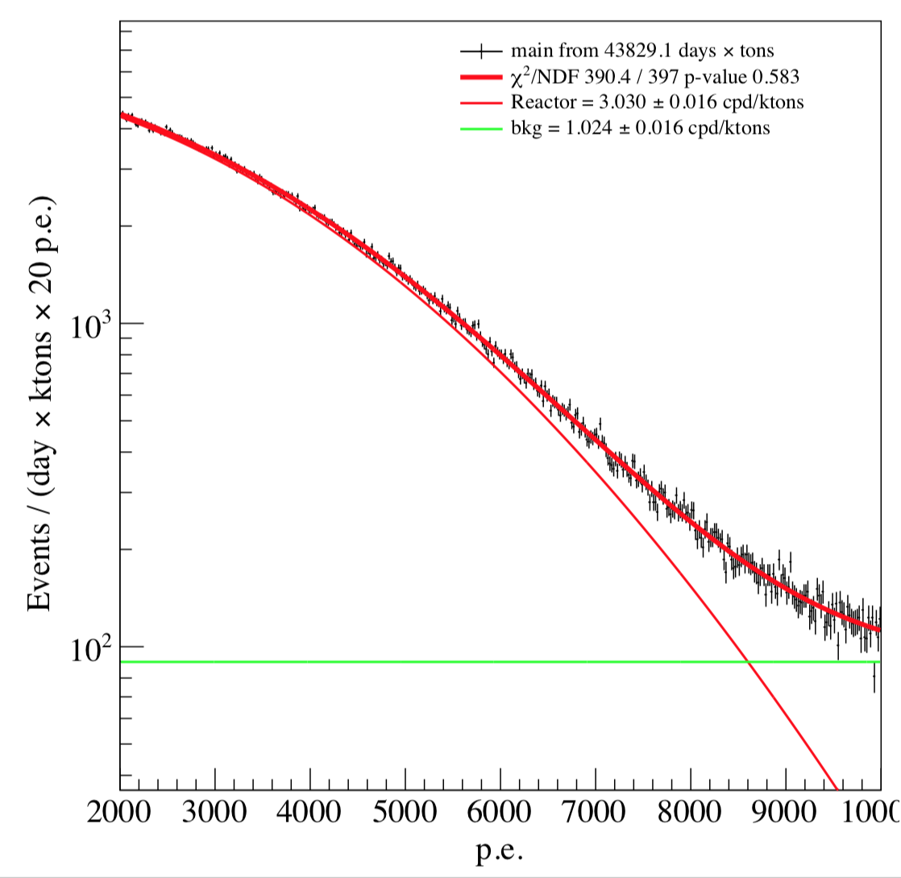
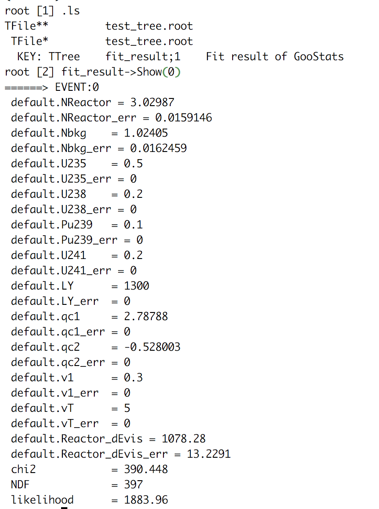
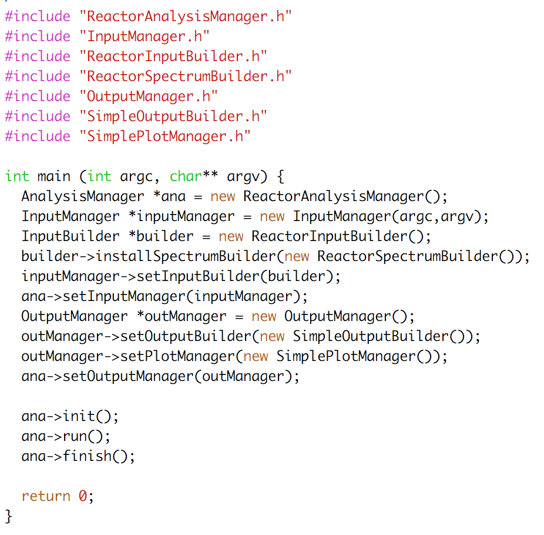
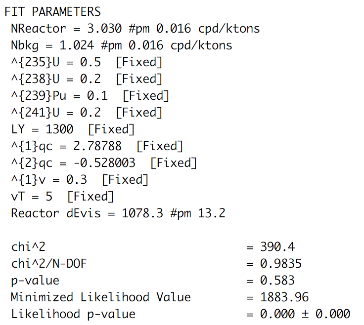

# GooStats
## GooStats is an open source statistical analysis framework using GPUs. 
  - It provide handful tools to configura input parametrs, datasets, spectrums, pdfs etc. 
  - It also provide flexible text/plot/TTree output class. 
  - The backend is [GooFit](http://github.com/GooFit/GooFit) on nVidia GPU, and the code is tuned and validated on GPU.
## With a few lines of code, you will be able to use GooFit as low level engine and produce nice plots
  - with a few more lines, you will be able to do joint analysis of multiple datasets. 
  - Look at Modules/naive-Reactor as an example.
  - Here are some screen shots of the text/TTree output and plot produced, as well as user code.
  
 
 

For any consult write to [Xuefeng Ding](mailto:xuefeng.ding.physics@gmail.com).

## If you find something strange, 
  - usually there is a GooStatsException thrown out together with stack-trace output, then you can understand the problem by looking at the line of crash.
  - If you still don't understand, look at [FAQ page](FAQ.md) and use ctrl+f.
  - If you still don't find the answer, [open and Issue](https://github.com/DingXuefeng/GooStats/issues/new). I will reply it.

## Contributions are well come. Feel free to use and contribute!

This framework has been utilized in Borexino and JUNO project. The physics result obtained with Borexino Module (closed source) has been presented in 
[TAUP 2017 poster](https://indico.cern.ch/event/606690/contributions/2591519/attachments/1499504/2334752/PosterTAUP_GPUfitter_v3.3.pdf)
